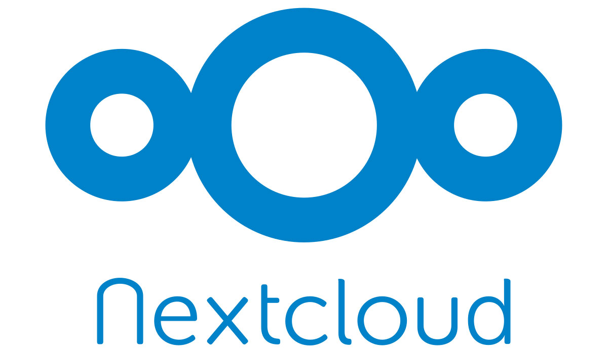

# Free and (mostly) Open Source Private Cloud <!-- omit in TOC -->

A curated collection of Free and Open Source Software to power your own private cloud.

## Contents <!-- omit in TOC -->

- [Services](#services)
  - [Webserver](#webserver)
  - [Autentication & User Management](#autentication--user-management)
  - [Nextcloud](#nextcloud)
  - [Mail](#mail)
  - [Mattermost](#mattermost)
  - [Jitsi](#jitsi)
  - [Monitoring & Logging](#monitoring--logging)
- [Resources](#resources)
- [Powered By](#powered-by)

## Services

This is an overview of services which are supported and functional with this Docker setup.

### Webserver

### Autentication & User Management

### Nextcloud

### Mail

### Mattermost

### Jitsi

### Monitoring & Logging

## Resources

https://docs.google.com/document/d/1uG8OLFpA9MtCt-M_BkFxx-WejQnB89aKVtif-tjlils/edit#

## Powered By

- https://github.com/jwilder/docker-gen
- https://github.com/i-core/werther
- https://github.com/pulsejet/nextcloud-oidc-login